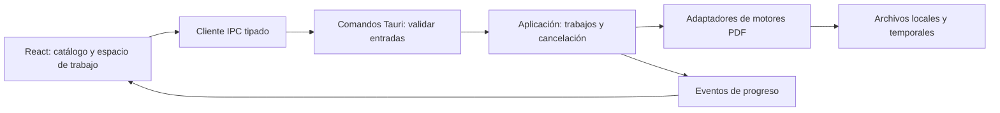

# Plan de PDF Utils

## Alcance de esta entrega

Inicializar la aplicación de escritorio, su interfaz, un comando nativo de diagnóstico y los workflows de CI y releases MSI. Las 32 utilidades de la referencia forman el alcance futuro. Ninguna procesa documentos todavía.

## Decisiones

| Área | Elección | Motivo |
| --- | --- | --- |
| Aplicación Windows | Tauri 2, Windows 10/11 x64 | Ventana nativa sobre WebView2 y empaquetado MSI |
| Frontend | React, TypeScript estricto y Vite | Componentes para el futuro editor, compilación estática y tipos |
| Backend local | Rust dentro de Tauri | Acceso a archivos y ejecución de motores sin servidor HTTP |
| Estado inicial | Estado de React | El catálogo no necesita un almacén global |
| Persistencia | Ninguna inicialmente | Añadir preferencias en JSON; SQLite solo si el historial lo requiere |
| Distribución | GitHub Actions sobre Windows, WiX mediante Tauri | Instaladores MSI x64 por etiqueta de versión |

Prefiero Tauri a Electron porque aprovecha WebView2. WPF/WinUI sería viable para Windows, pero React facilita un editor visual y reutilizar componentes web. No habrá servicios remotos obligatorios. Los motores de conversión aumentarán el tamaño del instalador cuando se incorporen.

## Arquitectura objetivo

Ahora solo existen el catálogo, el cliente IPC y `get_app_info`. Los módulos de trabajos y motores se crearán al implementar el primer caso real, evitando capas vacías.

Estructura inicial: `src/App.tsx` compone la interfaz; `src/tools.ts` mantiene el catálogo; `src/native.ts` contiene el contrato IPC; `src-tauri/src/lib.rs` registra los comandos nativos. La configuración de ventana, permisos y MSI vive en `src-tauri`.

## Flujo de aplicación previsto

1. Elegir herramienta y documentos mediante diálogo nativo o arrastre.
2. Ver páginas y configurar la operación.
3. Elegir destino. Guardar una copia por defecto.
4. Ejecutar un trabajo con estados queued, running, succeeded, failed y cancelled.
5. Mostrar progreso, resultado y acceso al archivo guardado.

Rust validará rutas, formatos y opciones. La UI enviará identificadores de documentos, no el contenido PDF completo por IPC. Las tareas intensivas irán a workers o procesos hijos con cancelación y límites. Cada trabajo tendrá su directorio temporal, limpieza tras fallos y escritura final atómica. Errores con código y mensaje, sin registrar contraseñas ni contenido. No se concederán permisos generales de shell o filesystem a la interfaz.

## Cobertura y fases

| Fase | Utilidades de la referencia | Implementación prevista |
| --- | --- | --- |
| 1. Páginas | Unir, dividir, organizar, rotar, recortar | Evaluar un motor estructural como qpdf/lopdf con documentos reales |
| 2. Contenido | Editar, marca de agua, números de página, JPG a PDF, PDF a JPG, formularios | Renderizador PDF y motor de escritura; edición inicial por anotaciones, edición de texto existente como hito separado |
| 3. Seguridad y calidad | Proteger, desbloquear, reparar, comprimir, PDF/A, comparar, redactar | Cifrado y recuperación según capacidades del motor; comparación visual y textual; redacción irreversible con verificación del contenido eliminado |
| 4. Conversión | Word a PDF, PowerPoint a PDF, Excel a PDF, PDF a Word, PDF a PowerPoint, PDF a Excel, HTML a PDF, PDF a Markdown | Office a PDF mediante adaptador a LibreOffice; motor específico para reconstrucción inversa; HTML en proceso aislado; extracción estructurada a Markdown |
| 5. Captura y firma | Escanear a PDF, OCR PDF, firmar PDF | Evaluar WIA/TWAIN y cámara; OCR con idiomas instalables; separar firma dibujada de firma criptográfica con certificado |
| 6. Automatización y lenguaje | Resumen IA, traducir PDF, crear un workflow | Proveedor local o remoto opcional, consentimiento antes de subir contenido; secuencias de trabajos reutilizando operaciones |

Los motores citados son candidatos, no dependencias ya elegidas o incluidas. Antes de integrarlos habrá una prueba de fidelidad, tiempo, memoria, tamaño y licencia de redistribución. Ningún motor único cubre toda la referencia. PDF a Office editable, conservación de maquetación al traducir y reparación de archivos dañados no tienen fidelidad garantizada. PDF/A necesita validación independiente; comprimir puede perder calidad. Desbloquear usará la contraseña cuando sea necesaria.

La solicitud de firmas a otras personas y la captura desde móvil de la referencia requieren intercambio de documentos y, potencialmente, un servicio. Se definirán en fase 5; no se simulan como una capacidad local ya resuelta. IA remota será opcional y sus credenciales se guardarán en el almacén seguro de Windows.

## Interfaz

Catálogo en español, navegación por categoría, búsqueda y estados explícitos. Estilo de escritorio sobrio: fondo claro, tinta oscura, acento terracota y tarjetas compactas. La siguiente fase incorporará espacio de trabajo con lista de archivos, visor, opciones y panel de progreso. Soporte de teclado, etiquetas accesibles y adaptación a ventana estrecha desde la base.

## Validación y entrega

En esta fase: TypeScript y build del frontend; formato, Clippy y pruebas Rust en CI; generación MSI en CI y releases. Con el primer motor se añadirán pruebas de integración sobre PDFs de muestra, comprobación de páginas, errores, cancelación y conservación de originales. Antes de distribuir a usuarios: instalar, actualizar y desinstalar en una VM Windows limpia y comprobar WebView2.

Las etiquetas `vX.Y.Z` deben coincidir con `package.json`, `Cargo.toml` y `tauri.conf.json`. El workflow compila y publica el MSI en una release de GitHub. La ejecución manual solo genera un artefacto. No se crea ninguna etiqueta ni se publica nada en esta entrega. No hay actualizador automático todavía. El MSI inicial no lleva firma de código; incorporar certificado o servicio de firma antes de distribución pública.

## Referencias técnicas

- [Requisitos de Tauri](https://v2.tauri.app/start/prerequisites/).
- [MSI y WebView2](https://v2.tauri.app/distribute/windows-installer/).
- [Pipeline oficial de Tauri](https://v2.tauri.app/distribute/pipelines/github/).
- [Vite](https://vite.dev/guide/).
